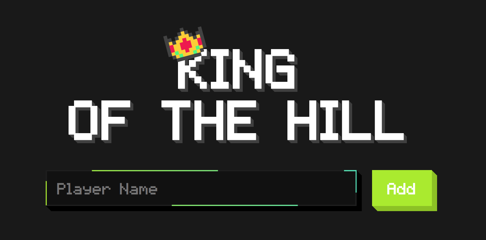

# King Of The Hill

A webapp to track wins and loses in a King of the Hill type of game



## Description

My friends and I love playing video games, so every Friday night we get together and start new adventures. One day one of the guys surprised us by buying an arcade machine, which came with the very famous game Puzzle Bubble and got us addicted immediately.

Once we started playing Multiplayer (let’s remember that mode is only 1 vs 1) we had to set a rule to keep us changing spots. That means winner stays, so everyone who was not playing had to wait for their turn.  Everything was fine when only 4 or 5 of us where gaming, but when it came to 10 of us getting together, things started getting complicated. This is why I decided to make this webapp, so we could track who was playing and who was waiting.
After getting that done (the order and who was playing), I decided to take this webapp a step further by keeping track of players wins, loses and even keeping scores on every match.

## The Flow

The app starts at the AddPlayersView, in this view you can add/remove players. After adding all the players the game starts.

In the MatchView you get to see who gets to play, and who waits. To select a winner you’ll only need to press on the player name.
After a player has completed a match, the WaitingPlayersList will update and show some of the player stats (played, wins and lost).
A player can win a crown when it has made a round (beaten all the waiting players in a row). So, the skull beside the waiting players name (the gate keeper, as we like to call it) is the last player to be beaten by the current winner in its way to get a crown.

Once all the matches have been played (there’s no limit) you get to see the StatsView. On this view you can check out more in-depth stats of any player, best streak, crowns and even their record against other players.

## Misc

Special thanks to my friends Moti, Thomy, Nahue, Herni, Maxi, Ricky, Joaco, Chomp and Fede who gave me the inspiration to code this :)

## Dev Enviroment

```
npm install
```

And then to start the development environment you run

 ```
npm run dev
```

## License

MIT © Turbofacu 2018
